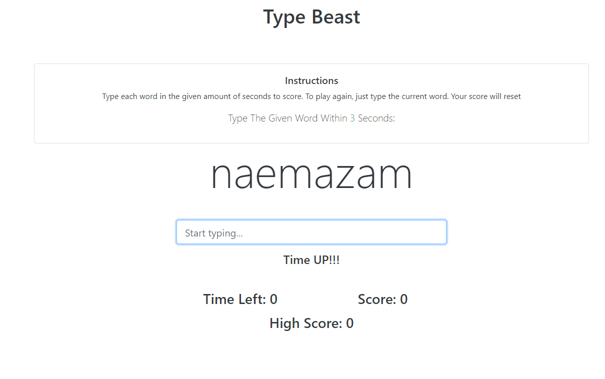
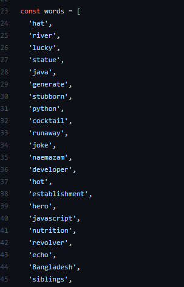

# TypeBeast
A simple typing speed test Website based on html and js. 
Want to know how to improve your typing speed? The first step to learn to type fast and increase your typing speed is to take a timed typing test! Our 1-minute, 3-minute, and 5-minute timed typing speed tests are free and can be used by children or adults to check average words per minute (WPM). The results of this WPM keyboard test will give you both your typing speed and your typing accuracy results.

# Demo

[Word](https://naemazam.github.io/TypeBeast/) [Story](https://naemazam.github.io/TypeBeast/letter.html)

# Contribution 

Yes !! You can add More Words To make it more Use full, Goto **main.js**  file And Add your words and Make a Pull request. 

